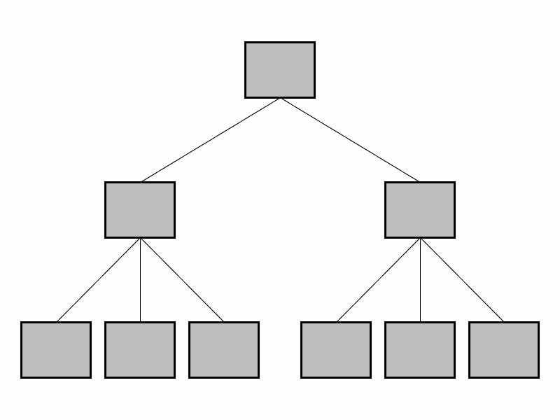
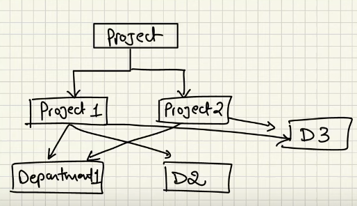
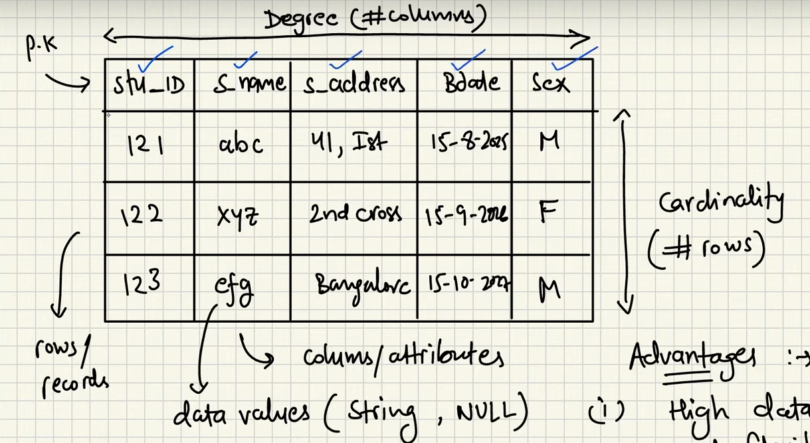
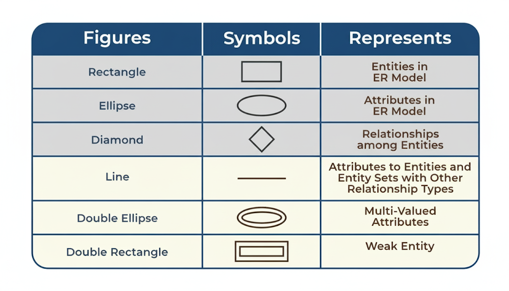
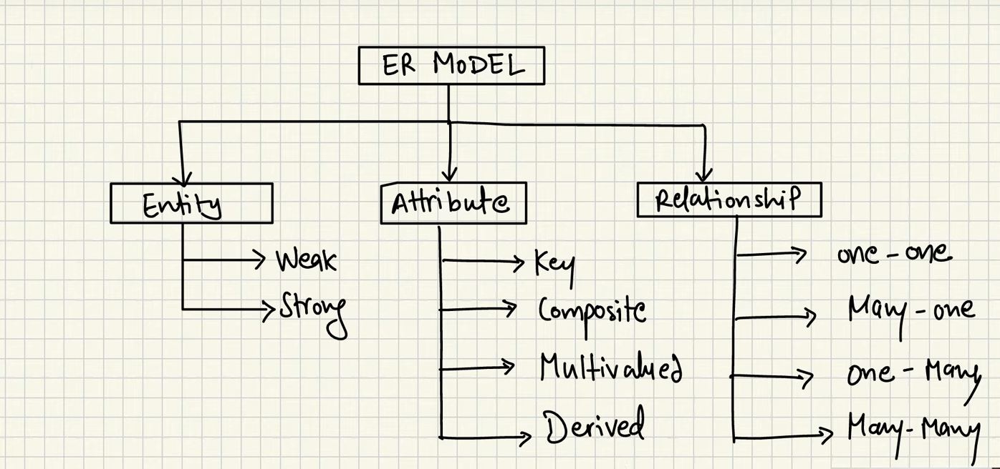

# Database Management System (DBMS) Notes

This repository contains notes (only important) on Database Management Systems (DBMS), covering key concepts, architectures, and data models. It serves as a resource for understanding how DBMS organizes data, maintains relationships, and provides efficient data management.

### Table of Contents

- [Database Management System (DBMS) Notes](#database-management-system-dbms-notes)
    - [Table of Contents](#table-of-contents)
    - [What is DBMS?](#what-is-dbms)
    - [File System vs. DBMS](#file-system-vs-dbms)
    - [Data Redundancy and Inconsistency](#data-redundancy-and-inconsistency)
    - [Data Sharing and Concurrency](#data-sharing-and-concurrency)
    - [Data Search and Integrity](#data-search-and-integrity)
    - [System Crash Recovery](#system-crash-recovery)
    - [Applications of DBMS](#applications-of-dbms)
    - [Three-Level Architecture of DBMS](#three-level-architecture-of-dbms)
    - [Data Models](#data-models)
      - [Hierarchical Model](#hierarchical-model)
      - [Network Model](#network-model)
      - [Relational Model](#relational-model)
      - [Entity-Relationship (ER) Model](#entity-relationship-er-model)
  - [DBMS Application Architecture](#dbms-application-architecture)
  - [Some Important Terms](#some-important-terms)
  - [Relational Model](#relational-model-1)
  - [Keys](#keys)
  - [Constraints and Its Types](#constraints-and-its-types)
  - [Normalization](#normalization)

### What is DBMS?

A Database Management System (DBMS) is a software system designed to organize, store, and manage data efficiently while maintaining relationships, constraints, and data integrity.

### File System vs. DBMS

- **File System**: Organizes data in a hierarchical structure of files and folders, capable of storing text, binary data, audio, etc. However, it lacks features like relationships, constraints, data types, and mechanisms to handle inconsistency and redundancy.
- **DBMS**: Provides a structured approach to data management with support for relationships, constraints, querying, and concurrency control, overcoming the limitations of file systems.

### Data Redundancy and Inconsistency

- **Inconsistency**: Occurs when data in one file is updated but not reflected in another file. For example, if `File1` is copied to `File2` and changes are made to `File1`, `File2` remains unchanged, leading to inconsistency.
- **Redundancy**: Refers to unnecessary duplication of data across multiple files, which wastes storage and increases the risk of inconsistency.

### Data Sharing and Concurrency

- **DBMS**: Enables easy data sharing through a centralized database. It provides locking mechanisms to manage concurrent access by multiple users, preventing anomalies.
- **File System**: Lacks isolation, leading to potential issues when multiple users access or modify files simultaneously.

### Data Search and Integrity

- **DBMS**: Offers simple query languages (e.g., SQL) for efficient data searching and ensures data integrity through constraints like primary keys and foreign keys.
- **File System**: Requires custom software for searching across different file types, with no built-in mechanisms for ensuring data integrity.

### System Crash Recovery

DBMS includes a recovery manager to restore data to a consistent state after system crashes, ensuring data reliability. File systems typically lack such robust recovery mechanisms.

### Applications of DBMS

- Ticket Booking Systems
- E-commerce Platforms
- Financial Data Management

### Three-Level Architecture of DBMS

DBMS uses a three-level architecture to abstract data and simplify interaction:

1. **Internal Level/ Physical level**: Manages physical storage, data structures, and access paths.
2. **Conceptual/Logical Level**: Defines the structure and constraints of the entire database.
3. **External/View Level**: Provides customized views for different users (e.g., Client → Server → Database).

**Goals of the Three-Level Architecture**:
- Allow users to access data without needing to understand low-level storage details.
- Enable customized views for different users.
- Allow the DBA to modify the underlying structure without affecting user views.

### Data Models

Before the Entity-Relationship (ER) model, several data models were used to organize data in DBMS:

#### Hierarchical Model

Developed by IBM, this model organizes data in a tree-like structure where each child record has one parent.

- **Advantages**:
  - Simple and intuitive for one-to-many relationships.
  - Efficient for retrieving hierarchical data.
- **Disadvantages**:
  - Difficult to incorporate complex data structures.
  - Prone to data redundancy and inconsistency.

#### Network Model

Organizes data as a directed graph, allowing multiple parents and children for records.

- **Advantages**:
  - More flexible than the hierarchical model.
  - Supports many-to-many relationships.
- **Disadvantages**:
  - Increased complexity in design and maintenance.
  - Not user-friendly for querying.

#### Relational Model

Represents data in tables, with rows (tuples) and columns (attributes).

- **Terminology**:
  - **Degree**: Total number of columns in a table.
  - **Cardinality**: Total number of rows in a table.
- **Advantages**:
  - High data independence and flexibility.
  - Eliminates duplication through normalization.
  - Easy querying using SQL.
- **Disadvantages**:
  - Complex for straightforward searches.
  - Requires understanding of normalization and query optimization.

#### Entity-Relationship (ER) Model

A conceptual model representing real-world entities and their relationships by the means of graphical representation.

- **Entities**:
  - **Strong Entity**: Independent, with a primary key for unique identification (represented by a rectangle). Example: A `Customer` entity with a primary key `CustomerID`.
  - **Weak Entity**: Depends on another entity for existence, lacking a primary key. Example: An `Order` entity dependent on a `Customer` entity.
  

---

## DBMS Application Architecture

- **Tier 1 (T1)**: Client + Server + DB on the same machine.
- **Tier 2 (T2)**: User → Application → Query statement is sent over network call → DB on server. Direct DB call is made.
- **Tier 3 (T3)**: User → Application (client) → Network → Application (server) → DB. No direct DB call is made.

> Tier 3 is used in WWW. It helps maintain data integrity, security, and is scalable.

---

## Some Important Terms

**Entity**: A real-world object or concept that can be distinctly identified, such as a person, place, or thing (e.g., Employee, Department).

**Attribute**: A property or characteristic of an entity.
- **Simple**: Cannot be divided further (e.g., Account number).
- **Composite**: Can be divided into subparts (e.g., Address → state, city, pincode).
- **Single Value**: Holds only one value for an entity (e.g., age).
- **Multi Value**: Can hold multiple values (e.g., phone numbers).
- **Derived**: Calculated from other attributes (e.g., age from DOB).
- **Null Value**: May have no value or unknown value.

**Relationship**: An association between entities (e.g., employee works in a department).

**Cardinality Constraint**: Specifies the number of instances of one entity associated with instances of another.

**Constraints**: Rules enforced on data to ensure accuracy and reliability.

**Degree of Relationship**: Number of entities participating in a relationship (unary, binary, ternary).

**Relationship Constraints**:
- 1:1 (One-to-One)
- 1:N (One-to-Many)
- N:1 (Many-to-One)
- N:M (Many-to-Many)

---

## Relational Model

- Represented in tables (relations)
- **Degree of Table**: Number of attributes (columns)
- **Cardinality**: Number of tuples (rows)
- **Tuple**: A single row representing a record

**DBMS vs RDBMS**:
- **DBMS**: Software for creating/managing databases; may not follow relational principles.
- **RDBMS**: DBMS following relational model rules (tables, keys, constraints) like MySQL, Oracle.

---

## Keys

- **Primary Key**: Unique identifier; cannot be null (e.g., Employee ID).
- **Super Key**: Set of attributes uniquely identifying a record (e.g., {Employee ID, Name}).
- **Candidate Key**: Minimal super key; multiple candidate keys may exist.
- **Foreign Key**: Attribute referring to primary key in another table.
- **Composite Key**: Primary key with multiple attributes (e.g., {Order ID, Product ID}).
- **Compound Key**: Another term for composite key.
- **Surrogate Key**: Artificial key (auto-incremented ID) used as primary key.

---

## Constraints and Its Types

**Integrity Constraint**:
- **Domain Constraint**: Restricts datatype/values of an attribute.
- **Entity Constraint**: Each relation must have PK; PK values cannot be null.

**Referential Constraint (Foreign Key Constraint)**:
- **Insert Constraint**: Cannot insert value in child table if absent in parent table.
- **Delete Constraint**: Cannot delete value from parent table if referenced in child table (or cascade applies).

**Key Constraint**:
- Not Null: Attribute cannot be null.
- Unique: All values in an attribute are unique.
- Others: Check, Default, etc.

---

## Normalization

**Definition**: Organizing data to reduce redundancy and improve integrity by dividing large tables into smaller ones and defining relationships.

**Types**:
1. **1NF (First Normal Form)**: Every cell contains atomic values; no repeating groups.
2. **2NF (Second Normal Form)**: 1NF + no partial dependency on part of primary key.
3. **3NF (Third Normal Form)**: 2NF + no transitive dependency.
4. **Boyce-Codd Normal Form (BCNF)**: Every determinant is a candidate key; eliminates anomalies from functional dependencies.

