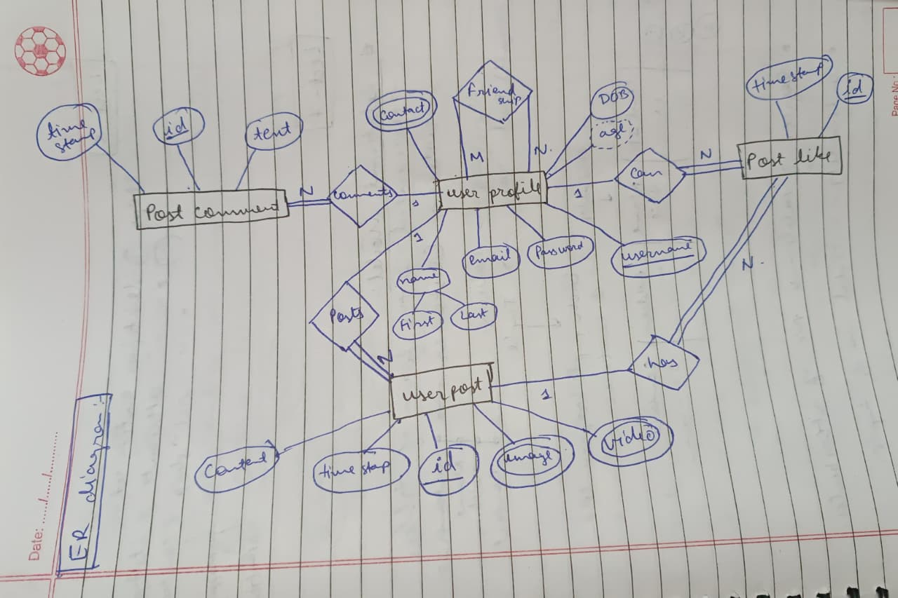

# Database Management System (DBMS) Notes

This repository contains notes (only important) on Database Management Systems (DBMS), covering key concepts, architectures, and data models. It serves as a resource for understanding how DBMS organizes data, maintains relationships, and provides efficient data management.

### Table of Contents

- [Database Management System (DBMS) Notes](#database-management-system-dbms-notes)
    - [Table of Contents](#table-of-contents)
    - [What is DBMS?](#what-is-dbms)
    - [DBMS vs RDBMS](#dbms-vs-rdbms)
    - [Different Types of Databases](#different-types-of-databases)
    - [File System vs. DBMS](#file-system-vs-dbms)
    - [Data Redundancy and Inconsistency](#data-redundancy-and-inconsistency)
    - [Data Sharing and Concurrency](#data-sharing-and-concurrency)
    - [Data Search and Integrity](#data-search-and-integrity)
    - [System Crash Recovery](#system-crash-recovery)
    - [Applications of DBMS](#applications-of-dbms)
    - [Three-Level Architecture of DBMS](#three-level-architecture-of-dbms)
    - [Data Models](#data-models)
      - [Hierarchical Model](#hierarchical-model)
      - [Network Model](#network-model)
      - [Relational Model](#relational-model)
      - [Entity-Relationship (ER) Model](#entity-relationship-er-model)
    - [DBMS Application Architecture](#dbms-application-architecture)
    - [Some Important Terms](#some-important-terms)
    - [Relational Model](#relational-model-1)
    - [Keys](#keys)
    - [Constraints and Its Types](#constraints-and-its-types)
    - [Normalization](#normalization)
      - [**1NF Example**](#1nf-example)
      - [**2NF Example**](#2nf-example)
      - [**3NF Example**](#3nf-example)
      - [**BCNF Example**](#bcnf-example)
    - [ACID properties](#acid-properties)
    - [Transaction-](#transaction-)
    - [Master-Slave Architecture](#master-slave-architecture)
    - [Horizontal vs Vertical Scaling](#horizontal-vs-vertical-scaling)
    - [Clustering vs Sharding](#clustering-vs-sharding)
    - [CAP Theorem](#cap-theorem)
    - [Armstrong Axioms](#armstrong-axioms)
    - [Types of Anomalies](#types-of-anomalies)
    - [Indexing in Database](#indexing-in-database)
      - [Types of Indexing:](#types-of-indexing)
    - [B and B+ Trees](#b-and-b-trees)
      - [**B-Tree**](#b-tree)
      - [**B+ Tree**](#b-tree-1)
    - [Serializability in DBMS](#serializability-in-dbms)
    - [Types of Serializability](#types-of-serializability)
    - [Key Difference between Conflict and View Serializability](#key-difference-between-conflict-and-view-serializability)

### What is DBMS?

A Database Management System (DBMS) is a software system designed to organize, store, and manage data efficiently while maintaining relationships, constraints, and data integrity.

### DBMS vs RDBMS

| Feature | DBMS (Database Management System) | RDBMS (Relational DBMS) |
|---------|---------------------------------|-------------------------|
| **Data Structure** | Stores data as files, often in hierarchical or navigational models | Stores data in tables (rows and columns) with relationships |
| **Relationship** | Usually doesn’t support relationships between data | Supports relationships between tables using primary & foreign keys |
| **Normalization** | Rarely supports normalization | Supports normalization to reduce redundancy |
| **Data Integrity** | Limited support for integrity constraints | Strong support for integrity (like unique, not null, foreign key) |
| **SQL Support** | May not fully support SQL; uses custom query language | Uses standard SQL for querying and managing data |
| **Examples** | Microsoft Access (older versions), file systems | MySQL, Oracle, PostgreSQL, SQL Server |
| **Concurrency** | Limited multi-user support | Supports multiple users accessing data concurrently |
| **Security** | Basic security | Advanced security features (like roles, permissions) |

**Summary:**  
- **DBMS:** General data storage and management system.  
- **RDBMS:** Advanced DBMS that organizes data into tables with relationships, ensuring **data integrity, security, and easy querying**.


### Different Types of Databases

Databases can be classified based on their **data model, structure, and purpose**:

1. **Hierarchical Database**
   - Organizes data in a **tree-like structure**.
   - Parent-child relationships; each child has only one parent.
   - Example: IBM IMS.

2. **Network Database**
   - Data is organized as **records connected by links** (graph structure).
   - More flexible than hierarchical databases.
   - Example: IDMS.

3. **Relational Database (RDBMS)**
   - Stores data in **tables (rows and columns)** with relationships.
   - Supports SQL for querying and managing data.
   - Example: MySQL, PostgreSQL, Oracle.

4. **Object-Oriented Database**
   - Stores data as **objects**, like in programming languages.
   - Supports complex data types and inheritance.
   - Example: db4o, ObjectDB.

5. **Document Database**
   - Stores data in **document formats**, usually JSON, BSON, or XML.
   - Popular in NoSQL databases.
   - Example: MongoDB, CouchDB.

6. **Key-Value Database**
   - Stores data as **key-value pairs**.
   - Very fast for simple lookups.
   - Example: Redis, DynamoDB.

7. **Columnar Database**
   - Stores data in **columns instead of rows**.
   - Optimized for analytical queries and big data.
   - Example: Cassandra, HBase.

8. **Graph Database**
   - Stores data as **nodes and edges**, representing entities and relationships.
   - Used for social networks, recommendation engines, etc.
   - Example: Neo4j, ArangoDB.

9. **Time-Series Database**
   - Optimized for **time-stamped data**.
   - Example: InfluxDB, TimescaleDB.

10. **Cloud Database**
    - Hosted on the cloud with **scalability and high availability**.
    - Example: Amazon RDS, Google Firebase.


### File System vs. DBMS

- **File System**: Organizes data in a hierarchical structure of files and folders, capable of storing text, binary data, audio, etc. However, it lacks features like relationships, constraints, data types, and mechanisms to handle inconsistency and redundancy.
- **DBMS**: Provides a structured approach to data management with support for relationships, constraints, querying, and concurrency control, overcoming the limitations of file systems.

### Data Redundancy and Inconsistency

- **Inconsistency**: Occurs when data in one file is updated but not reflected in another file. For example, if `File1` is copied to `File2` and changes are made to `File1`, `File2` remains unchanged, leading to inconsistency.
- **Redundancy**: Refers to unnecessary duplication of data across multiple files, which wastes storage and increases the risk of inconsistency.

### Data Sharing and Concurrency

- **DBMS**: Enables easy data sharing through a centralized database. It provides locking mechanisms to manage concurrent access by multiple users, preventing anomalies.
- **File System**: Lacks isolation, leading to potential issues when multiple users access or modify files simultaneously.

### Data Search and Integrity

- **DBMS**: Offers simple query languages (e.g., SQL) for efficient data searching and ensures data integrity through constraints like primary keys and foreign keys.
- **File System**: Requires custom software for searching across different file types, with no built-in mechanisms for ensuring data integrity.

### System Crash Recovery

DBMS includes a recovery manager to restore data to a consistent state after system crashes, ensuring data reliability. File systems typically lack such robust recovery mechanisms.

### Applications of DBMS

- Ticket Booking Systems
- E-commerce Platforms
- Financial Data Management

### Three-Level Architecture of DBMS

DBMS uses a three-level architecture to abstract data and simplify interaction:

1. **Internal Level/ Physical level**: Manages physical storage, data structures, and access paths.
2. **Conceptual/Logical Level**: Defines the structure and constraints of the entire database.
3. **External/View Level**: Provides customized views for different users (e.g., Client → Server → Database).

**Goals of the Three-Level Architecture**:
- Allow users to access data without needing to understand low-level storage details.
- Enable customized views for different users.
- Allow the DBA to modify the underlying structure without affecting user views.

### Data Models

Before the Entity-Relationship (ER) model, several data models were used to organize data in DBMS:

#### Hierarchical Model

Developed by IBM, this model organizes data in a tree-like structure where each child record has one parent.


- **Advantages**:
  - Simple and intuitive for one-to-many relationships.
  - Efficient for retrieving hierarchical data.
- **Disadvantages**:
  - Difficult to incorporate complex data structures.
  - Prone to data redundancy and inconsistency.

#### Network Model

Organizes data as a directed graph, allowing multiple parents and children for records.


- **Advantages**:
  - More flexible than the hierarchical model.
  - Supports many-to-many relationships.
- **Disadvantages**:
  - Increased complexity in design and maintenance.
  - Not user-friendly for querying.

#### Relational Model

Represents data in tables, with rows (tuples) and columns (attributes).


- **Terminology**:
  - **Degree**: Total number of columns in a table.
  - **Cardinality**: Total number of rows in a table.
- **Advantages**:
  - High data independence and flexibility.
  - Eliminates duplication through normalization.
  - Easy querying using SQL.
- **Disadvantages**:
  - Complex for straightforward searches.
  - Requires understanding of normalization and query optimization.

#### Entity-Relationship (ER) Model

A conceptual model representing real-world entities and their relationships by the means of graphical representation.





- **Entities**:
  - **Strong Entity**: Independent, with a primary key for unique identification (represented by a rectangle). Example: A `Customer` entity with a primary key `CustomerID`.
  - **Weak Entity**: Depends on another entity for existence, lacking a primary key. Example: An `Order` entity dependent on a `Customer` entity.
  

---

### DBMS Application Architecture

- **Tier 1 (T1)**: Client + Server + DB on the same machine.
- **Tier 2 (T2)**: User → Application → Query statement is sent over network call → DB on server. Direct DB call is made.
- **Tier 3 (T3)**: User → Application (client) → Network → Application (server) → DB. No direct DB call is made.

> Tier 3 is used in WWW. It helps maintain data integrity, security, and is scalable.

---

### Some Important Terms

**Entity**: A real-world object or concept that can be distinctly identified, such as a person, place, or thing (e.g., Employee, Department).

**Attribute**: A property or characteristic of an entity.
- **Simple**: Cannot be divided further (e.g., Account number).
- **Composite**: Can be divided into subparts (e.g., Address → state, city, pincode).
- **Single Value**: Holds only one value for an entity (e.g., age).
- **Multi Value**: Can hold multiple values (e.g., phone numbers).
- **Derived**: Calculated from other attributes (e.g., age from DOB).
- **Null Value**: May have no value or unknown value.

**Relationship**: An association between entities (e.g., employee works in a department).

**Cardinality Constraint**: Specifies the number of instances of one entity associated with instances of another.

**Constraints**: Rules enforced on data to ensure accuracy and reliability.

**Degree of Relationship**: Number of entities participating in a relationship (unary, binary, ternary).

**Relationship Constraints**:
- 1:1 (One-to-One)
- 1:N (One-to-Many)
- N:1 (Many-to-One)
- N:M (Many-to-Many)

---

### Relational Model

- Represented in tables (relations)
- **Degree of Table**: Number of attributes (columns)
- **Cardinality**: Number of tuples (rows)
- **Tuple**: A single row representing a record

**DBMS vs RDBMS**:
- **DBMS**: Software for creating/managing databases; may not follow relational principles.
- **RDBMS**: DBMS following relational model rules (tables, keys, constraints) like MySQL, Oracle.

---

### Keys

- **Primary Key**: Unique identifier; cannot be null (e.g., Employee ID).
- **Super Key**: Set of attributes uniquely identifying a record (e.g., {Employee ID, Name}).
- **Candidate Key**: Minimal super key; multiple candidate keys may exist.
- **Foreign Key**: Attribute referring to primary key in another table.
- **Composite Key**: Primary key with multiple attributes (e.g., {Order ID, Product ID}).
- **Compound Key**: Another term for composite key.
- **Surrogate Key**: Artificial key (auto-incremented ID) used as primary key.

---

### Constraints and Its Types

**Integrity Constraint**:
- **Domain Constraint**: Restricts datatype/values of an attribute.
- **Entity Constraint**: Each relation must have PK; PK values cannot be null.

**Referential Constraint (Foreign Key Constraint)**:
- **Insert Constraint**: Cannot insert value in child table if absent in parent table.
- **Delete Constraint**: Cannot delete value from parent table if referenced in child table (or cascade applies).

**Key Constraint**:
- Not Null: Attribute cannot be null.
- Unique: All values in an attribute are unique.
- Others: Check, Default, etc.

---

### Normalization

**Definition**: Organizing data to reduce redundancy and improve integrity by dividing large tables into smaller ones and defining relationships.

**Types**:
1. **1NF (First Normal Form)**: Every cell contains atomic values; no repeating groups.
2. **2NF (Second Normal Form)**: 1NF + no partial dependency on part of primary key.
3. **3NF (Third Normal Form)**: 2NF + no transitive dependency.
4. **Boyce-Codd Normal Form (BCNF)**: Every determinant is a candidate key; eliminates anomalies from functional dependencies.

#### **1NF Example**
**Unnormalized Table** (Repeating groups ❌):

| StudentID | Name    | Subjects          |
|-----------|---------|-------------------|
| 1         | Raj     | Math, Science     |
| 2         | Simran  | English, History  |

**1NF Table** (Atomic values ✅):

| StudentID | Name   | Subject   |
|-----------|--------|-----------|
| 1         | Raj    | Math      |
| 1         | Raj    | Science   |
| 2         | Simran | English   |
| 2         | Simran | History   |

---

#### **2NF Example**
**1NF Table with Partial Dependency ❌** (Composite key: *StudentID + SubjectID*):

| StudentID | SubjectID | StudentName | SubjectName |
|-----------|-----------|-------------|-------------|
| 1         | 101       | Raj         | Math        |
| 1         | 102       | Raj         | Science     |
| 2         | 103       | Simran      | English     |

Here, **StudentName** depends only on `StudentID` (partial dependency).

**2NF Tables ✅** (Split into two):

**Student Table**  
| StudentID | StudentName |
|-----------|-------------|
| 1         | Raj         |
| 2         | Simran      |

**Subject Table**  
| SubjectID | SubjectName |
|-----------|-------------|
| 101       | Math        |
| 102       | Science     |
| 103       | English     |

**Enrollment Table**  
| StudentID | SubjectID |
|-----------|-----------|
| 1         | 101       |
| 1         | 102       |
| 2         | 103       |

---

#### **3NF Example**
**2NF Table with Transitive Dependency ❌**:

| StudentID | StudentName | DepartmentID | DepartmentName |
|-----------|-------------|--------------|----------------|
| 1         | Raj         | D1           | Computer Sci   |
| 2         | Simran      | D2           | English Lit    |

Here, `DepartmentName` depends on `DepartmentID` (not directly on `StudentID` → transitive dependency).

**3NF Tables ✅**:

**Student Table**  
| StudentID | StudentName | DepartmentID |
|-----------|-------------|--------------|
| 1         | Raj         | D1           |
| 2         | Simran      | D2           |

**Department Table**  
| DepartmentID | DepartmentName |
|--------------|----------------|
| D1           | Computer Sci   |
| D2           | English Lit    |

---

#### **BCNF Example**
**3NF Table with Anomaly ❌**:

| Course  | Instructor | Room |
|---------|------------|------|
| Math    | Dr. A      | 101  |
| Physics | Dr. B      | 102  |
| Math    | Dr. A      | 103  |

Here:  
- A course determines an instructor (Course → Instructor).  
- A room determines a course (Room → Course).  
Not all determinants are candidate keys.

**BCNF Tables ✅**:

**Course-Instructor Table**  
| Course  | Instructor |
|---------|------------|
| Math    | Dr. A      |
| Physics | Dr. B      |

**Course-Room Table**  
| Course  | Room |
|---------|------|
| Math    | 101  |
| Math    | 103  |
| Physics | 102  |

### ACID properties
1. **Atomicity**- Either all operations will be reflected in DB or none.
2. **Consistency**- Integrity constraint must me maintained before and after transaction.
3. **Isolation**- There must me isolation in the system. This property ensures that multiple transactions can occur simultaneously
without causing any inconsistency.
4. **Durability**- After successful transaction, the changes in DB should persist even in case of system failure.

### Transaction- 
Transaction is a single logical unit of work formed by a set of operations.

### Master-Slave Architecture

Master-Slave architecture is a **replication model** used in databases to improve **read performance** and **availability**.

- **Master Node**: Handles all **write operations** (INSERT, UPDATE, DELETE). It is the authoritative source of data.
- **Slave Nodes**: Handle **read operations** and replicate data from the master.
- **Replication**: Can be synchronous (slaves always up-to-date) or asynchronous (slaves may lag slightly).

**Advantages**:
- Improved read performance.
- High availability and redundancy.
- Offloading backups to slaves.

**Disadvantages**:
- Single point of failure for writes.
- Possible replication lag.
- Complex failover management.

**Diagram**:
```
      +--------+
      | Master |
      +--------+
      /       \
     /         \
+--------+   +--------+
| Slave1 |   | Slave2 |
+--------+   +--------+

```


---

### Horizontal vs Vertical Scaling

**Scaling** is a way to handle increased load on a database system.

1. **Vertical Scaling (Scaling Up)**:
   - Increase resources of a single machine (CPU, RAM, storage).
   - Simple to implement.
   - Limited by hardware capacity.
   
2. **Horizontal Scaling (Scaling Out)**:
   - Add more machines to the system.
   - Can handle large-scale data and traffic.
   - More complex (requires distribution of data and load balancing).

**Comparison**:

| Feature            | Vertical Scaling          | Horizontal Scaling       |
|-------------------|-------------------------|-------------------------|
| Approach           | Upgrade a single server | Add more servers        |
| Limitations        | Hardware limits         | Complexity of management|
| Cost               | Can be expensive        | Scales better with demand|
| Fault Tolerance    | Low                     | High (redundancy)       |

---

### Clustering vs Sharding

1. **Clustering**:
   - Multiple database nodes work together to provide **high availability**.
   - Each node can serve **all data** (replicated across nodes).
   - Failover is easier.

2. **Sharding**:
   - Data is **partitioned across multiple nodes**.
   - Each node stores only a **subset of the data**.
   - Improves **write and read performance** for very large datasets.

**Comparison**:

| Feature          | Clustering                    | Sharding                     |
|-----------------|--------------------------------|-------------------------------|
| Data Distribution | Full replication             | Partitioned (subset per node)|
| Use Case         | High availability            | Large dataset scaling         |
| Complexity       | Moderate                     | High (routing required)       |
| Fault Tolerance  | High                         | Depends on shard replication  |

---

### CAP Theorem

**CAP Theorem** states that a distributed database system can provide only **two out of three** guarantees simultaneously:

1. **Consistency (C)**: All nodes see the same data at the same time.
2. **Availability (A)**: Every request receives a response (success or failure).
3. **Partition Tolerance (P)**: The system continues to operate despite network partitions.

**Implications**:
- CA systems: Strong consistency and availability, but no tolerance to network partitions.
- CP systems: Consistency and partition tolerance, may sacrifice availability.
- AP systems: Availability and partition tolerance, may sacrifice consistency.

---

### Armstrong Axioms
Armstrong’s Axioms are a set of **inference rules** used to derive all possible functional dependencies from a given set of functional dependencies in a relational database.

1. **Reflexivity**: If Y ⊆ X, then X → Y.  
2. **Augmentation**: If X → Y, then XZ → YZ (adding attributes preserves dependency).  
3. **Transitivity**: If X → Y and Y → Z, then X → Z.  
4. **Union**: If X → Y and X → Z, then X → YZ.  
5. **Decomposition (Projectivity)**: If X → YZ, then X → Y and X → Z.  
6. **Pseudotransitivity**: If X → Y and YZ → W, then XZ → W.

---

### Types of Anomalies
Anomalies occur when database design is not normalized:

1. **Update Anomaly**  
   - Same data is stored at multiple places.  
   - Updating one record requires updating all occurrences.  
   - Example: Changing an instructor’s name in multiple rows.

2. **Insert Anomaly**  
   - Inability to add data due to missing attributes.  
   - Example: Cannot add a new course until at least one student enrolls in it.

3. **Delete Anomaly**  
   - Deleting one record unintentionally removes useful data.  
   - Example: Deleting the last student of a course also deletes the course information.

---

### Indexing in Database
Indexing improves the **speed of data retrieval** but may add overhead in insertion, deletion, and update operations.

#### Types of Indexing:

1. **Clustered Indexing**
   - Data is stored in **sorted order** based on the primary key.  
   - One clustered index per table (since data can only be sorted one way).  
   - Faster for range queries.  
   - Extra cost during insertions and deletions.  
   - Example: EmployeeID as clustered index.

2. **Non-Clustered Indexing**
   - Index table contains pointers (addresses) to the actual data.  
   - Multiple non-clustered indexes can exist on a table.  
   - Does not affect the physical order of data.  
   - Slower than clustered for sequential access but efficient for random lookups.  
   - Example: Index on EmployeeName while EmployeeID remains clustered.

---

### B and B+ Trees

#### **B-Tree**
- A self-balancing search tree.  
- Each node can have multiple keys and children.  
- Keys are distributed across internal nodes and leaf nodes.  
- Searching requires traversing both internal and leaf nodes.  
- Suitable for smaller datasets.

#### **B+ Tree**
- An advanced version of B-Tree used in databases and file systems.  
- **Only leaf nodes** contain actual data (records).  
- Internal nodes contain only keys (used for navigation).  
- Leaf nodes are linked (linked list) → enables fast range queries.  
- Provides better sequential access and efficient disk I/O.  


### Serializability in DBMS

**Definition**:  
Serializability is the **concept of ensuring that the result of executing concurrent transactions is the same as if the transactions were executed serially (one after another)**.  

In simple words: **It makes sure transactions running together give the same result as if they were run one by one.**

---

### Types of Serializability

1. **Conflict Serializability**
   - A schedule is conflict serializable if it can be **transformed into a serial schedule by swapping non-conflicting operations**.
   - Two operations conflict if:
     - They belong to different transactions.
     - They operate on the same data item.
     - At least one of them is a write.
   - Example:  
     - Transactions T1 and T2 with operations:  
       - T1: Read(A), Write(A)  
       - T2: Read(A), Write(A)  
     - If reordered safely without changing result → conflict serializable.

2. **View Serializability**
   - A schedule is view serializable if it is **view equivalent** to a serial schedule.
   - Conditions:
     1. Initial read in both schedules must read the same value.
     2. Every read must see the same value in both schedules.
     3. Final write must be the same in both schedules.
   - More general than conflict serializability (i.e., every conflict-serializable schedule is view-serializable, but not vice versa).

---

### Key Difference between Conflict and View Serializability

| Feature              | Conflict Serializability | View Serializability |
|----------------------|--------------------------|-----------------------|
| **Definition**       | Achieved by swapping non-conflicting operations | Achieved if schedules are view-equivalent |
| **Checking**         | Easier (using precedence graph) | Harder (NP-complete problem) |
| **Relation**         | Subset of view serializability | Superset of conflict serializability |
| **Practical use**    | Widely used in DBMS | Rarely used (complex) |


